&emsp;&emsp;Redis 中的每个键值对( key-value pair )都是由对象( object )组成的:

- 数据库键永远都是一个字符串对象( string object )。
- 数据库键值可以是字符串对象( string object )、列表对象( list object )、哈希对象( hash object )、集合对象( set object )、有序集合对象( sorted set object )这五种对象中的其中一种。

这里主要介绍五个不同类型的对象，以及这些对象所使用的底层数据结构。

<!--more-->


# 简单动态字符串

&emsp;&emsp;Redis 把简单动态字符串( simple dynamic string, SDS )作为 Redis 的默认字符串表示。


&emsp;&emsp;在 Redis 中，C 字符串和简单动态字符串的使用场景如下:

- C 字符串只会作为字符串字面量( string literal ) 用在一些无需对字符串值进行修改的地方，比如打印日志:

```
redisLog(REDIS_WARNING,"Redis is now ready to exit");
```

- 当 Redis 需要的不仅仅是一个字符串字面量，而是一个可以被修改的字符串值时，Redis 就会使用 SDS 来表示字符串，比如在 Redis 数据库中，包含字符串值的键值对在底层实现都是由 SDS 实现的。
- 除了用来保存数据库中的字符串值之外，SDS 还被用作缓冲区( buffer ):AOF 模块中的 AOF 缓冲区，以及客户端状态中的输入缓冲区，都是由 SDS 实现的。


## SDS 的定义

&emsp;&emsp;sds.h/sdshdr 的结构

```
	struct sdshdr {
	
		// 记录 buf 数组中已使用的字节数量，等于 SDS 所保存的字符串长度。
		int len;
			
		// 记录 buf 数组中未使用的字节数量。
		int free;
			
		// 字节数组，用来保存字符串
		char buf[];
	}
```

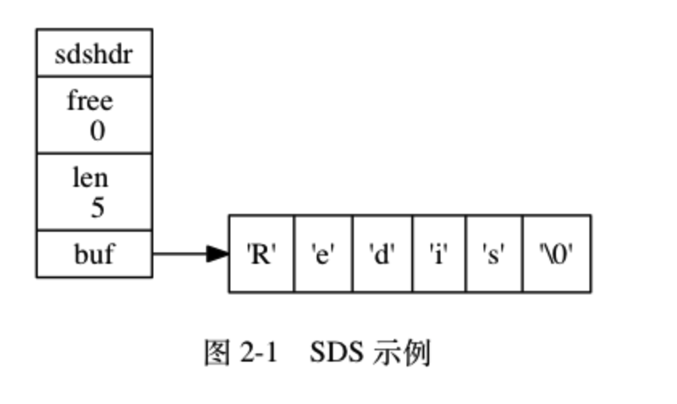

**说明**: SDS 遵循 C 字符串以空字符结尾的惯例，保存空字符的 1 字节空间不计算在 SDS 的 len 属性中，并且为空字符分配额外的 1 字节空间，以及添加空字符到字符串末尾等操作，都是由 SDS 函数自动完成的，所以这个空字符串对于 SDS 的使用者来说是完全透明的。**遵循空字符结尾这一惯例的好处是**，**SDS 可以直接使用一部分 C 字符串函数库里的函数**。


## SDS 与 C 字符串的区别

&emsp;&emsp;Redis 为什么使用 SDS ？先放结论，因为 C 字符串无法满足 Redis 对字符串在安全性、效率以及功能方面的要求。


### 常数时间复杂度获取字符串长度

&emsp;&emsp;因为 C 字符串不记录自身的长度信息，所以为了获取 C 字符串的长度，必须遍历整个字符串，这个操作的时间复杂度为 O(N)。对于 SDS 而言，因为 len 属性记录了 SDS 本身的长度，所以获取一个 SDS 长度的时间复杂度为 O(1)，设置和更新 SDS 长度的工作是由 SDS 的 API 在执行时自动完成的，使用 SDS 无须进行任何手动修改长度的操作。通过使用 SDS 而不是 C 字符串，Redis 将获取字符串长度的时间复杂度从 O(N) 降低到 O(1)。


### 杜绝缓冲区溢出

&emsp;&emsp;除了获取字符串长度的复杂度高以外，C 字符串不记录自身长度带来的另外一个问题时容易造成缓冲区溢出( buffer overflow )。

&emsp;&emsp;举个例子，`<string.h>/strcat` 函数可以将 src 字符串中的内容拼接到 dest 字符串的末尾:

```
		char *strcat(char *dest, const char *src);
```

&emsp;&emsp;假设程序中有两个在内存中相邻的 C 字符串 s1 和 s2，如下图所示:

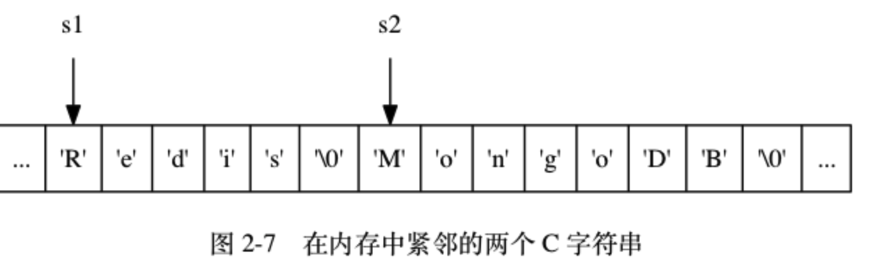


当执行 `strcat(s1, "Cluster")`  时

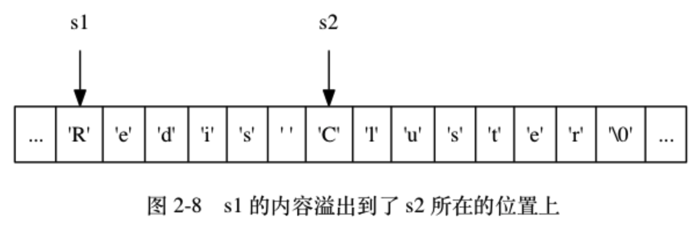


&emsp;&emsp;与 C 字符串不同，SDS 的空间分配策略杜绝发生缓冲区溢出的可能:当 SDS API 需要对 SDS 进行修改的时候，API 会先检查 SDS 的空间是否满足修改所需的要求，如果不满足，会进行扩容以满足所需的大小，然后才执行实际的修改操作，所以使用 SDS 既不需要手动修改 SDS 的空间大小，也不会出现前面所说的缓冲区溢出的问题。


### 减少修改字符串时所带来的内存重分配次数

&emsp;&emsp;由于 C 字符串不记录本身的长度，所以对于一个包含 N 个字符的 C 字符串来说，这个 C 字符串的底层实现总是 N + 1 个字符长的数组(额外一个字符空间用来保存空字符)，正因为 C 字符串的长度和底层数组的长度存在着这种关联，所以修改 C 字符串长度的时候，总要对保存 C 字符串的数组进行一次内存的重新分配操作:

- 若是增长字符串的操作，程序需要通过内存重新分配来扩展底层数组的大小，避免发生缓冲区溢出。
- 若是缩短字符串的操作，程序需要通过内存重新分配来释放字符串不再使用的那部分空间，避免内存泄露。


&emsp;&emsp;通过未使用空间，SDS 实现了空间预分配和惰性空间释放两种优化策略。

#### **空间预分配**

&emsp;&emsp;当需要对 SDS 进行空间扩展的时候，程序不仅会为 SDS 分配修改所必须要的空间，还会为 SDS 分配额外的未使用空间。

&emsp;&emsp;额外分配的未使用空间大小由以下情况决定:

- 若对 SDS 进行修改之后，SDS 的长度(即 len 的属性值) 小于 1MB，那么程序分配和 len 属性同样大小的未使用空间。
- 若对 SDS 进行修改之后，SDS 的长度大于等于 1MB，那么程序会固定分配 1MB 的使用空间。

&emsp;&emsp;通过空间预分配策略，Redis 可以减少连续执行字符串增长操作所需的内存重新分配次数。通过这种预分配策略，SDS 将连续增长 N 次的字符串所需的内存分配次数从必定 N 次降低为至多 N 次。

#### **惰性空间释放**

&emsp;&emsp;惰性空间释放用于优化 SDS 的字符串缩短操作:当需要进行缩短的时候，程序不立即使用内存重新分配来回收多出来的空间，而是使用 free 属性将这些字节的数量记录下来，并等待将来使用。与此同时，SDS 也提供了 API，在有需要的时候，真正地释放 SDS 的未使用空间，所以不用担心惰性空间释放策略会造成内存浪费。


### 二进制安全

&emsp;&emsp;C 字符串中的字符必须符合某种编码(比如 ASCII )，并且除了字符串的末尾之外，字符串里面不能包含空字符，否则最先被读入的空字符会被认为是字符串结尾，这些限定使得 C 字符串值呢保存文本数据，而不能保存图片、音频、压缩文件这样的二进制数据。

&emsp;&emsp;SDS 的 API 都是二进制安全的( binary-safe ),所以 SDS API 都会以处理二进制的方式来处理 SDS 存放在 buf 数组中的数据，数据写入时是怎么样的，读取的时候就是什么。

&emsp;**&emsp;这也是将 SDS 的 buf 属性称为字节数组的原因—Redis 不是用这个数组来保存字符的，而是用它来保存二进制数据**。


### 兼容部分 C 字符串函数

&emsp;&emsp;SDS 由于也是以空字符结尾，所以可以重用一部分 `<string.h>` 库中的函数，避免不必要的代码重复。 


### 小结

**C 字符串和 SDS 的区别**

| C 字符串                                         | SDS                                              |
| ------------------------------------------------ | ------------------------------------------------ |
| 获取字符串长度的时间复杂度为O(N)                 | 获取字符串长度的时间复杂度为O(1)                 |
| API 不安全，可能会造成缓冲区溢出                 | API 安全，不会造成缓冲区溢出                     |
| 修改字符串长度 N 次必然需要执行 N 次内存重新分配 | 修改字符串长度 N 次至多需要执行 N 次内存重新分配 |
| 只能保存文本数据                                 | 可以保存文本和二进制数据                         |
| 可以使用`<string.h>`库中的所有函数               | 可以使用`<string.h>`库中的部分函数               |


# 链表

&emsp;&emsp;链表作为一种常用数据结构，内置在很多高级编程语言中，因为 Redis 使用的 C 语言并没有内置这种数据结构，所以 Redis 构建了自己的链表实现。

&emsp;&emsp;链表在 Redis 中的应用非常广泛，比如列表键的实现之一就是链表。当一个列表键包含了数量比较多的元素，又或者列表中包含的元素都是比较长的字符串时，Redis 就会使用链表作为一个列表键的底层实现。除了链表键之外，发布订阅、慢查询、监视器等功能也用到了链表，Redis 服务器本身还使用链表来保存多个客户端的状态信息，以及使用链表来构建客户端输出缓冲区( output buffer )。


## 链表和链表节点的实现

&emsp;&emsp;每个链表节点使用了一个 `adlist.h/listNode` 结构来表示:

```
	typedef struct listNode {
		// 前置节点
		struct listNode *prev;
		// 后置节点
		struct listNode *next;
		// 节点的值
		void *value;
	} listNode;
```

&emsp;&emsp;使用 `adlist.h/list` 来持有链表：

```
	typedef struct list {
		// 表头节点
		listNode *head;
		// 表尾节点
		listNode *tail;
		// 链表所包含的所有节点数量
		unsigned long len;
		// 节点值复制函数
		void *(*dup)(void *ptr);
		// 节点值释放函数
		void (*free)(void *ptr);
		// 节点值对比函数
		int (*match)(void *ptr,void *key);
	} list;
```

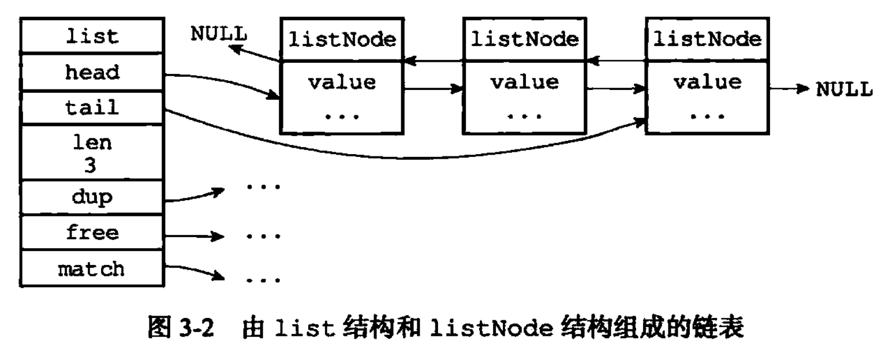


&emsp;&emsp;Redis 的链表实现特性总结如下:

- 双端:链表带有 prev 指针和 next 指针，获取某个节点的前置节点和后置节点的时间复杂度都为 O(1)。
- 无环:链表头节点的 prev 指针和链表尾节点的 next 指针都是指向 NULL，对链表的访问以 NULL 为终点。
- 带链表头指针和尾指针:通过 list 结构的 head 指针和 tail 指针，获取表头节点和表尾节点的时间复杂度为 O(1)。
- 带链表长度计数器:使用 list 结构的 len 属性来对 list 持有的链表节点进行计数，程序获取链表节点数量的时间复杂度为 O(1)。
- 多态:链表节点使用 void* 指针来保存节点值，并且可以通过 list 结构的 dup、free、match 三个属性为节点值设置类型特定函数，所以链表可以用于保存各种不同类型的值。


# 字典

&emsp;&emsp;字典，又称为符号表( symbol table )、关联数组( associative array )或映射 ( map ),是一种用于保存键值对( key-value pair )的抽象数据结构。


## 字典的实现

&emsp;&emsp;Redis 的字典使用哈希表作为底层实现，一个哈希表里面可以有多个哈希节点，而每个哈希表节点就保存了字典中的一个键值对。


### 哈希表

&emsp;&emsp;Redis 字典所使用的哈希表由 `dict.h/dictht` 结构定义:

```
	typedef struct dictht {
		// 哈希表数组
		dicEntry **table;
		// 哈希表大小
		unsigned long size;
		// 哈希表大小掩码，用于计算索引值，总是等于 size - 1
		unsigned long sizemask;
		// 该哈希表已有的节点数量
		unsigned long used;
	} dictht;
```

&emsp;&emsp;table 属性是一个数组，数组中的每个元素都是一个指向 `dict.h/dictEntry` 结构的指针，每个 dicEntry 结构保存着一个键值对。


### 哈希表节点

&emsp;&emsp;哈希表节点使用 `dict.h/dictEntry` 结构表示:

```
	typedef struct dictEntry {
	
		// 键
		void *key;
		
		// 值
		union {
			void *val;
			uint64_t u64;
			int64_t s64;
		} v;
		
		// 指向下个哈希表节点，形成链表
		struct dictEntry *next;
		
	} dictEntry;
```

&emsp;&emsp;next 属性是指向另外一个哈希表节点的指针，这个指针可以将多个哈希值相同的键值对连接在一起，以此解决键冲突的问题 ( collision ) 的问题。


### 字典

&emsp;&emsp;Redis 中的字典由 `dict.h/dict` 结构表示:

```
	typedef struct dict {
		// 类型特定函数
		dictType *type;
		// 私有数据
		void *privdata;
		// 哈希表
		dictht ht[2];
		// rehash 索引，当 rehash 不在进行时，值为 -1
		int trehashidx;/* rehashing not in progress if rehashidx == -1 */
	} dict;
```

&emsp;&emsp;type 属性和 privdata 属性是针对不同类型的键值对，为创建多态字典而设置的:

- type 属性是一个指向 dictType 结构的指针，每个 dictType 结构保存了一簇用于操作特定类型键值对的函数，Redis 会为用途不同的字典设置不同的类型特定函数。
- privdata 属性则保存了需要传给那些类型特定函数的可选参数。

```
	typedef struct dictType {
		// 计算哈希值的函数
		unsigned int (*hashFunction)(const void *key);
		// 复制键的函数
		void *(*keyDup)(void *privdata, const void *key);
		//  复制值的函数
		void *(*valDup)(void *privdata, const void *key);
		// 对比键的函数
		void *(*keyCompare)(void *privdata, const void *key1, const void *key2);
		// 销毁键的函数
		void (*keyDestructor)(void *privdata, void *key);
		// 销毁值的函数
		void (*valDestructor)(void *privdata, void *obj);
	} dictType;
```

&emsp;&emsp;ht 属性是一个包含两个项的数组，数组中的每一项都是 dictht 哈希表，一般情况下，字典只使用 ht[0] 哈希表, ht[1] 哈希表只会在对 ht[0] 哈希表进行 rehash 时使用。除了 ht[1] 之外，另外一个与 rehash 有关的的属性就是 rehashidx,它记录了 rehashidx 的进度，如果当前没有进行 rehash,那么 rehashidx 的值为 -1；

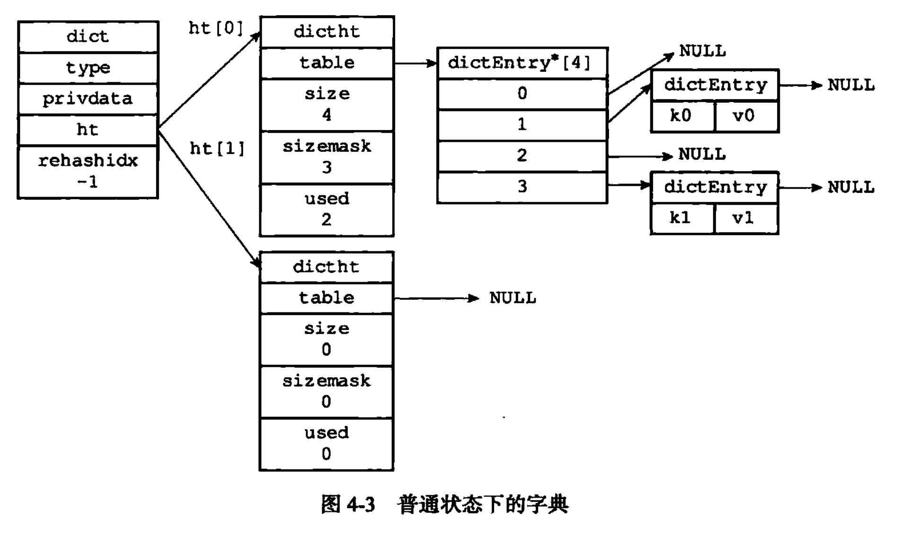

## 哈希算法

 &emsp;&emsp;当要将一个新的键值对添加到字典时，需要先根据键值对的键计算出哈希值，再通过哈希值计算出索引值，然后根据索引值，将包含新键值对的哈希表节点放到哈希表数组的指定索引上。

&emsp;&emsp;Redis 计算哈希值和索引值的方法如下:

```
	// 使用字典设置的哈希函数，计算键 key 的哈希值
	hash = dict->type->hashFunction(key);
	// 使用哈希表的 sizemask 属性和哈希值，计算出索引值
	// 根据情况不同，ht[x] 可以是 ht[0] 或者 ht[1]
	index = hash & dict->ht[x].sizemask;
```

&emsp;&emsp;当字典被用作数据库的底层实现，或者哈希键的底层实现时，Redis 使用 MurmurHash2 算法来计算哈希值。


## 解决键冲突

&emsp;&emsp;当有两个或者两个以上的键被分配到哈希表数组的同一个索引上时，我们称之为这些键发生了冲突( collision )。Redis 的哈希表使用链地址法( separate chaining )来解决键冲突，每个哈希表节点都有一个 next 指针，多个哈希表节点可以用 next 指针构成一个单向链表，被分配到同一个索引上的多个节点可以用这个单向链表连接起来，以此来解决键冲突的问题。

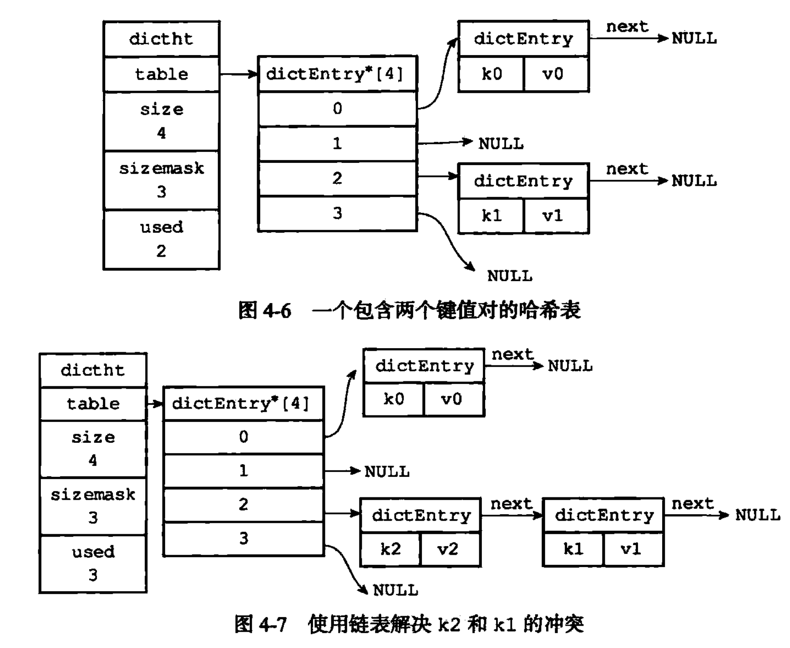

&emsp;&emsp;为了速度的考虑，程序总是将新节点添加到链表头的位置上(时间复杂度O(1))。


## rehash

&emsp;&emsp;随着操作不断的执行，哈希表保存的键值对会逐渐的变多或者变少，为了让哈希表的负载因子( load factor )维持在一个合理的范围之内，当哈希表保存着的键值对数量太多或者太少时，程序需要对哈希表的大小进行相应的扩展或者收缩。

&emsp;&emsp;扩展和收缩哈希表的工作可以通过执行 rehash( 重新散列 ) 操作来完成，Redis 对字典的哈希表执行 rehash 的步骤如下:

&emsp;1.为字典的 ht[1]  哈希表分配空间，这个哈希表的空间大小取决于要执行的操作，以及 ht[0] 当前包含的键值对数量(即 ht[0].used 属性的值)：

&emsp;&emsp;·如果执行的是扩展操作，那么 ht[1] 的大小为第一个大于等于 ht[0].used * 2 的 2^n( 2 的 n 次幂 )；

&emsp;&emsp;·如果执行的是收缩操作，那么 ht[1] 的大小为第一个大于等于 ht[0].used 的 2^n。

&emsp;2.将保存在 ht[0] 中的所有键值对 rehash 到 ht[1] 上面: rehash 指的是重新计算键的哈希值和索引值，然后将键值对放置到 ht[1] 的指定位置上。

&emsp;3.当 ht[0] 包含的所有键值对都迁移到 ht[1] 之后，释放 ht[0]，将 ht[1] 设置为 ht[0]，并在 ht[1] 新创建一个空白哈希表，为下次 rehash 做准备。

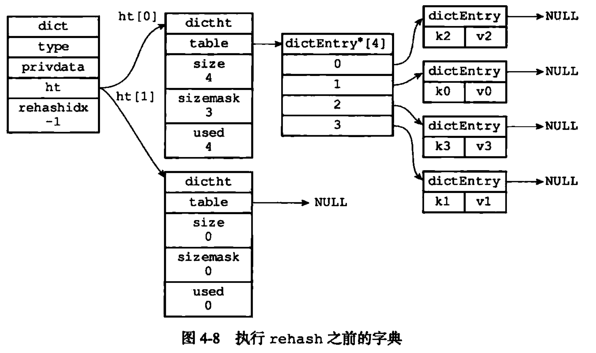

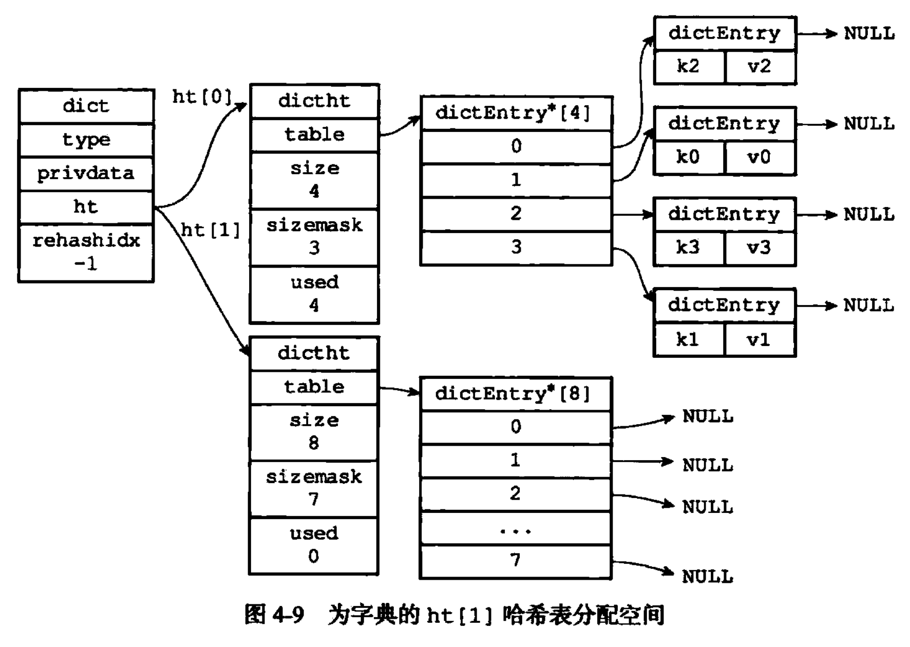

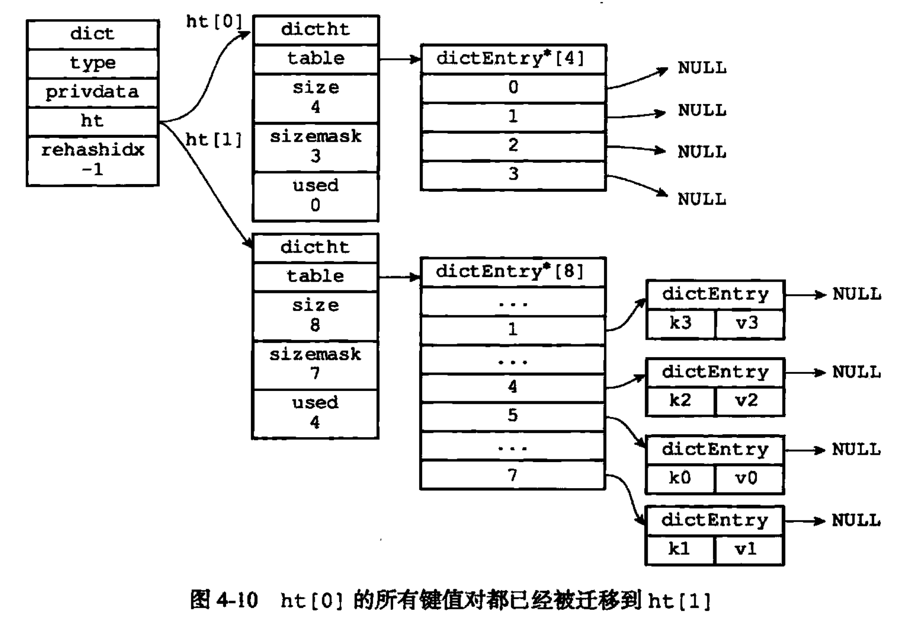

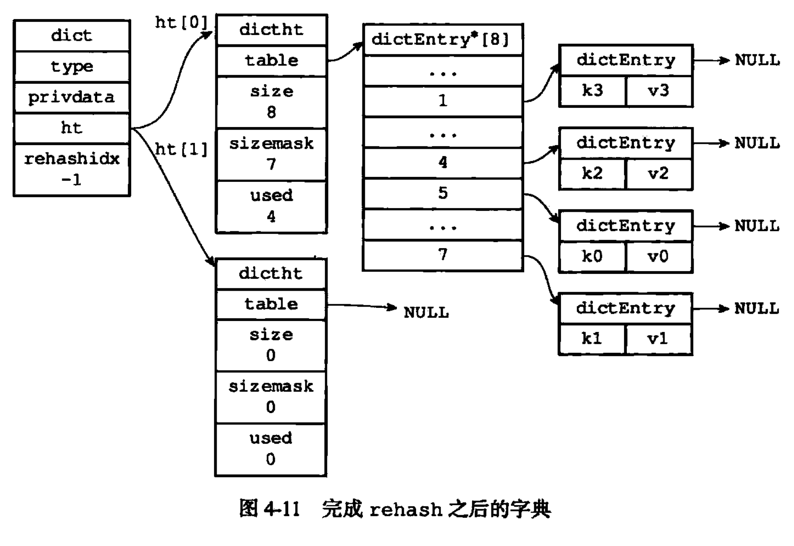

### 哈希表的扩展和收缩

&emsp;&emsp;当以下条件任意一个被满足的时候，程序会自动开始对哈希表执行扩展操作:

- 服务器目前没有在执行 `BGSAVE` 命令或者 `BGREWRITEAOF` 命令，并且哈希表的负载因子大于等于 1。
- 服务器目前正在执行 `BGSAVE` 命令或者 `BGREWRITEAOF` 命令，并且哈希表的负载因子大于等于 5。

&emsp;&emsp;其中哈希表的负载因子可以通过公式计算得出:

```
	// 负载因子 = 哈希表已保存节点数量 / 哈希表大小
	load_factor = ht[0].used / ht[0].size
```

&emsp;&emsp;根据 `BGSAVE` 命令或者 `BGREWRITEAOF` 命令释放正在执行，服务器执行扩展操作所需的负载因子并不相同，这是因为在执行 `BGSAVE` 命令或者 `BGREWRITEAOF` 命令的过程中，Redis 需要创建当前服务器进程的子进程，而大多数操作系统都采用写时复制( copy-on-write )技术来优化子进程的使用效率，所以在子进程存在期间，服务器会提高执行扩展操作所需的负载因子，从而尽可能避免在子进程存在期间进行哈希表的扩展操作，这也可以避免不必要的内存写入操作，最大限度地节约内存。

&emsp;&emsp;当哈希表的负载因子小于 0.1 时，程序会自动开始对哈希表执行收缩操作。


## 渐进式 rehash

&emsp;&emsp;上面有提到，扩展和收缩哈希表需要将 ht[0]  里的所有键值对 rehash 到 ht[1] 中，但是这个 rehah 动作并不是一次性，集中式地完成的，而是分多次、渐进式地完成的。这样子做的原因是，如果存在海量键值对，一次性将这些键值对 rehash 到 ht[1] 的话，可能需要让服务器停止服务一段时间。

&emsp;&emsp;以下是哈希表渐进式 rehahs 的详细步骤:

1. 为 ht[1] 分配空间，让字典同时持有 ht[0] 和 ht[1] 两个哈希表。
2. 在字典中维持一个索引计数器变量 rehashidx，并将它的值设置为 0，表示 rehash 正式开始。
3. 在 rehash 进行期间，每次对字典执行添加、删除、查找或者更新操作时，程序除了执行指定操作外，还会顺带将 ht[0] 哈希表在 rehashidx 索引上的所有键值对 rehash 到 ht[1]，当 rehash 工作完成之后，rehashidx 的值加一。
4. 随着字典操作的不断执行，最终在某个时间点上，ht[0] 的所有键值对都会被 rehash 到 ht[1]，这时将 rehashidx 的属性设置为 -1，表示 rehash 操作已经完成。

&emsp;&emsp;图 4-12 至图 4-17 展示了一次完整的渐进式 rehash 过程。

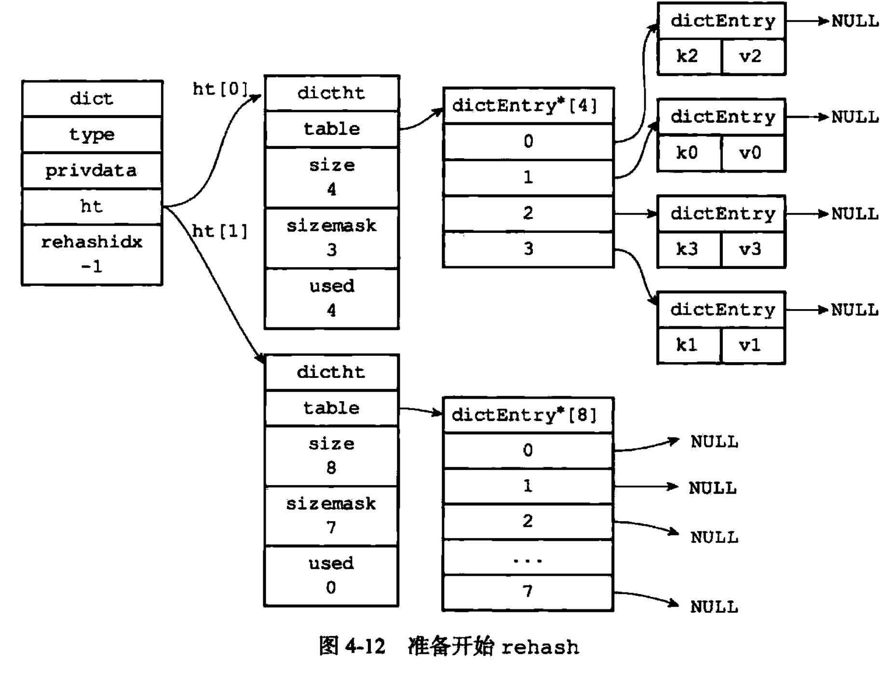

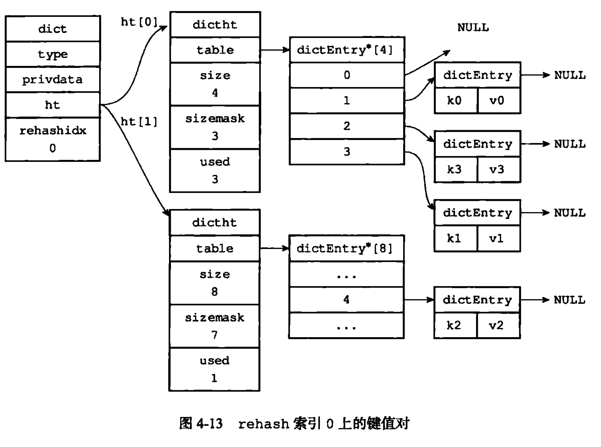

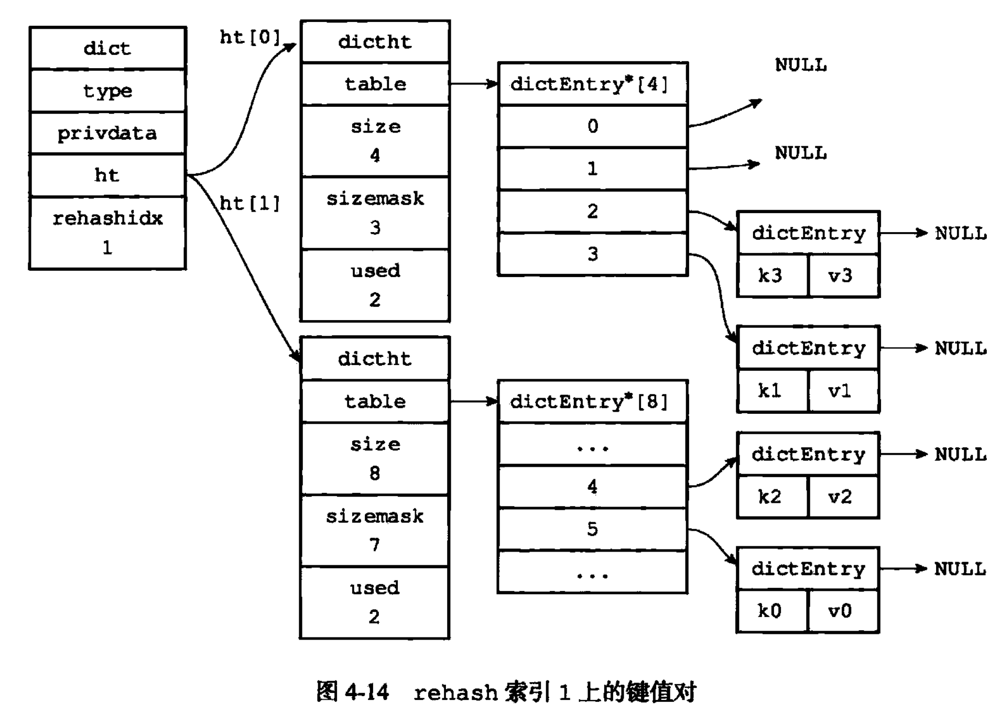

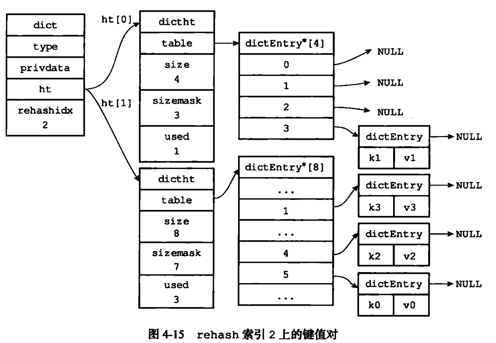

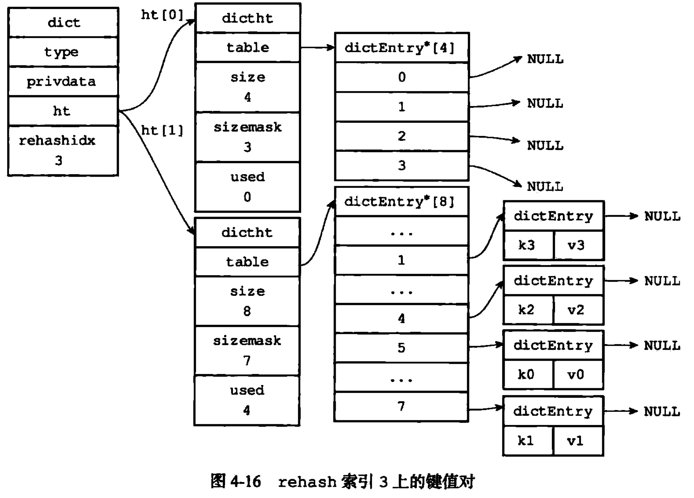

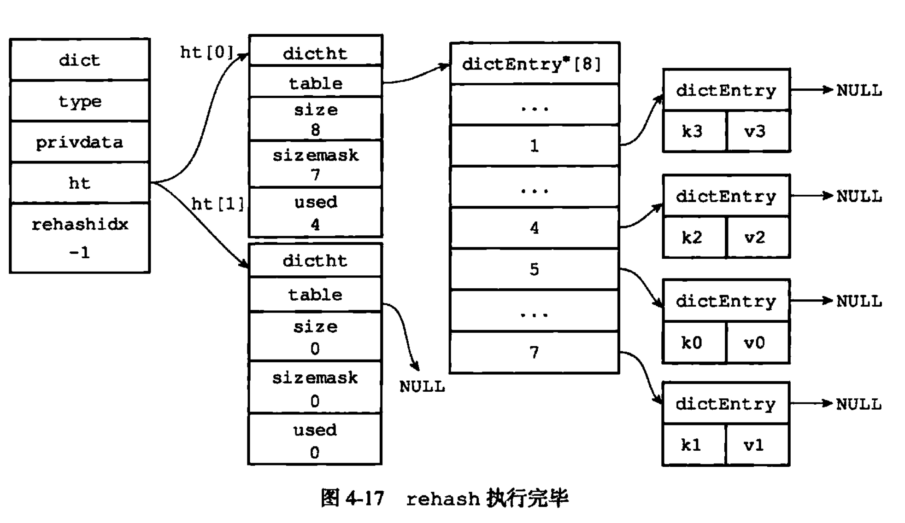

&emsp;&emsp;渐进式 rehash 的好处在于它采取分而治之的方式，将 rehash 键值对所需的计算工作均摊到对字典的每个添加、删除、查找和更新操作上，从而避免了集中式 rehash 而带来的庞大计算量。


### 渐进式 rehash 执行期间的哈希表操作

&emsp;&emsp;因为在进行渐进式 rehash 的过程中，字典会同时使用 ht[0] 和 ht[1] 两个哈希表。所以在进行渐进式 rehash 的过程中，字典的删除( delete )、查找( find )、更新( update )等操作会在两个哈希表上进行。例如，要在字典里面查找一个键的话，程序会先在 ht[0] 里面进行查找，如果没有找到的话，就会继续到 ht[1]  里面进行查找，诸如此类。

&emsp;&emsp;另外，在渐进式 rehash 的过程中，新添加到字典的键值对一律只会保存到 ht[1] 上，而 ht[0] 则不再进行任何添加操作，这一措施保证了 ht[0] 包含的键值对数量只会减少不会增加，并随着 rehash 操作的执行变成空表。


# 跳跃表

&emsp;&emsp;跳跃表( skiplist )是一种有序的数据结构，它通过在每个节点中维持多个指向其他节点的指针，从而达到快速访问节点的目的。跳跃表支持平均 O(logN)、最坏 O(N)复杂度的节点查找，还可以通过顺序性操作来批量处理节点。

&emsp;&emsp;大部分情况下，跳跃表的效率可以和平衡树媲美，并且因为跳跃表的实现比平衡树简单，所以有不少程序都使用跳跃表来代替平衡树。

&emsp;&emsp;Redis 只在两个地方用到了跳跃表，一个是实现有序集合键，另一个是在集群节点中用作内部数据结构。


## 跳跃表的实现

&emsp;&emsp;Redis 的跳跃表由 `redis.h/zskiplistNode` 和 `redis.h/zskiplist` 两个结构定义，其中 zskiplistNode 结构用于表示跳跃表节点，zskiplist 结构用于保存跳跃表节点的相关信息。

```
	typedef struct zskiplistNode {
		// 后退指针
		struct zskiplistNode *backward;
		// 分值：在跳跃表中节点按照各自所保存的分值从小到大排列
		double score;
		// 成员对象:在同一个跳跃表中，各个节点保存的成员对象必须是唯一的，但是多个节点的分值可以相同，分值相同的根据对象在字典序中的大小进行排序，较小的节点会排在靠近表头的方向上，较大的节点放在靠近表尾的方向上。
		robj *obj;
		// 层： level 数组可以包含多个元素，创建时随机生成 1 - 32 的值作为 level 的大小
		struct zskiplistLevel {
			// 前进指针
			struct zskiplistNode *forward;
			// 跨度：前进指针所指向节点和当前节点的距离;指向 NULL 节点的跨度为 0。rank 也是基于跨度计算的:查找访问中所有的跨度累加起来即为 rank
			unsigned int span;
		}level[];
	}zskiplistNode;
```

```
	typedef struct zskiplist {
		// head 和 tail 分别指向表头节点和表尾节点，获取这两个节点的时间复杂度为 O(1)
		structz skiplistNode *head,*tail;
		// 表中节点的数量
		unsigned long length;
		// 表中层数最大的节点的层数
		int level;
	}
```

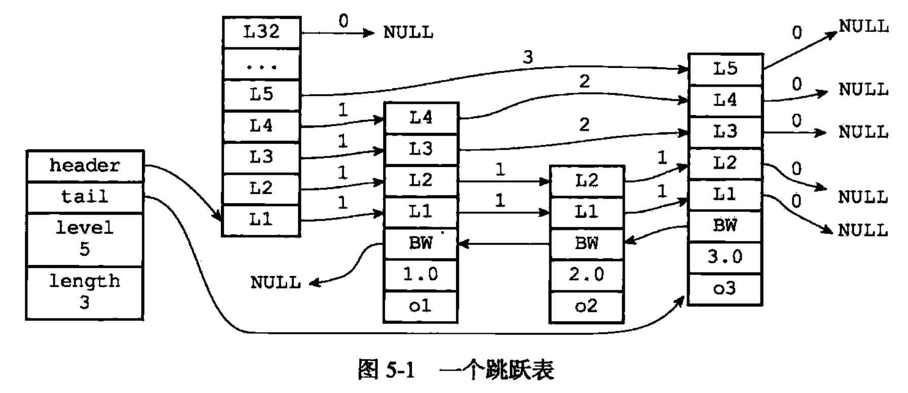

# 整数集合

&emsp;&emsp;整数集合( intset )是集合键的底层实现之一，当一个集合只包含整数值元素，并且这个集合的元素数量不多时，Redis 就会使用整数集合作为集合键的底层实现。整数集合可以保存类型为 int16_t、int32_t、int64_t的整数值，并且保证集合中不会出现重复元素。

&emsp;&emsp;`intset.h/intset` 结构表示一个整数集合:

```
	typedef struct intset {
		// 编码方式
		uint32_t encoding;
		// 集合包含的元素数量
		uint32_t length;
		// 保存元素的数组:各项在数组中按照值的大小有序排序，并且数组中不包含重复项
		int8_t contents[];
	}intset;
```

&emsp;&emsp;虽然 inset 结构将 contents 属性声明为 int8_t 类型的数组，但是真正类型取决于 encoding 属性的值:

- 如果 encoding 属性的值为 INTSET_ENC_INT16，那么 contents 就是一个 int16_t 类型的数组(-32768 ~ 32767)。
- 如果 encoding 属性的值为 INTSET_ENC_INT32，那么 contents 就是一个 int32_t 类型的数组(-2147483648 ~ 2147483647)。
- 如果 encoding 属性的值为 INTSET_ENC_INT64，那么 contents 就是一个 int64_t 类型的数组(-9223372036854775808 ~ 9223372036854775807)。

## 升级

&emsp;&emsp;每当将一个新元素添加到数组集合里，并且新元素的类型比整数集合现有所有元素的类型都要长的时候，整数集合需要升级( upgrade )。

&emsp;&emsp;升级集合并添加新元素总共分成三步:

1. 根据新元素的类型，苦熬站整数集合底层数组的空间大小，并未新元素分配空间。
2. 将底层数组现有的所有元素都转换成与新元素相同的类型，并将类型转换后的元素，放置到正确的位置上，并且放置的过程中，保持有序性不变。
3. 将新元素添加到底层数组中。


### 升级之后新元素的摆放位置

&emsp;&emsp;因为引发升级的新元素长度总是比整数集合中所有元素的长度都大，所以这个新元素的值要么大于当前所有元素，要么小于当前所有元素，所以新元素要么是放置在索引 0 的位置上，要么是放置在索引 length - 1 的位置上。


### 升级的好处

- 提升灵活性:C 语言上静态类型的语言，通常不会将不同类型的元素值放在同一个数据结构中，现在有了升级，不必担心类型错误。
- 节约内存:整数集合现在的做法是既可以保存三种类型的值，又可以确保升级是在必要时才进行，尽可能地节省空间。


### 降级

&emsp;&emsp;整数集合不支持降级操作。


# 压缩列表

&emsp;&emsp;压缩列表是列表键和哈希键的底层实现之一，当一个列表键只包含少量列表项，并且每个列表项要么就是小整数值，要么就是长度比较短的字符串，那么 Redis 就会使用压缩列表来做列表键的实现。

&emsp;&emsp;压缩列表是 Redis 为了节约内存而开发的，是由一系列特殊编码的连续内存块组成的顺序型数据结构，一个压缩列表可以包含任意个节点，每个节点可以保存一个数组或者是一个整数值。

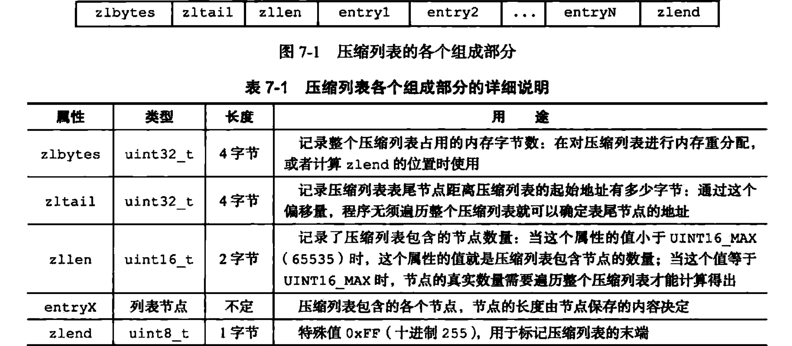


### previous_entry_length

&emsp;&emsp;记录了压缩列表前一个节点的长度，如果前一个节点长度小于 254 字节，那么该属性的长度为 1 字节。如果前一个节点长度大于 254 字节，那么该属性的长度为 5 字节。通过这个属性，可以计算出前一个节点的起始地址，压缩列表的从表尾到表头的遍历操作就是使用这个原理进行实现的。

### encoding

&emsp;&emsp;encoding 记录节点的 content 属性所保存的数据的类型和长度:

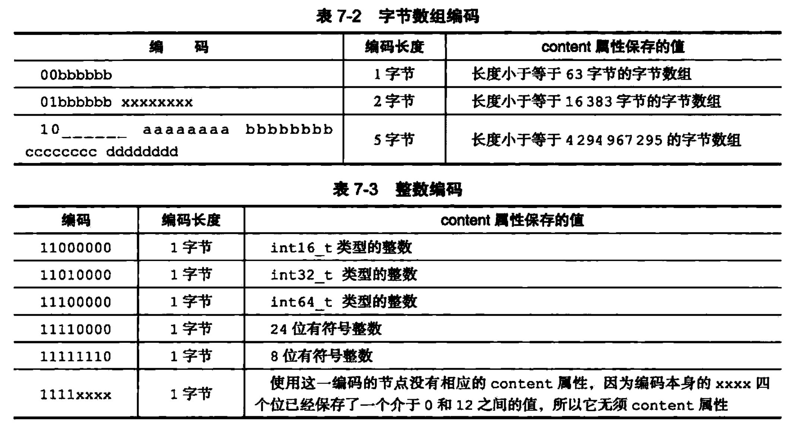


### content

&emsp;&emsp;节点的 content 属性负责保存节点的值，节点值可以是一个字节数组或者整数，值的类型和长度由节点的 encodint 属性决定。


## 连锁更新

&emsp;&emsp;在特殊情况下的，连续多次空间扩展。


# 对象

&emsp;&emsp;Redis 系统包含字符串对象、列表对象、哈希对象、集合对象和有序集合对象。


## 对象的类型和编码

&emsp;&emsp;Redis 中的每个对象都是由一个 redisObject 结构表示:

```
	typedef struct redisObject {
		// 类型
		unsigned type:4;
		// 编码
		unsigned encoding:4;
		// 指向底层实现数据结构的指针
		void *ptr;
		//...
	}
```


### 类型

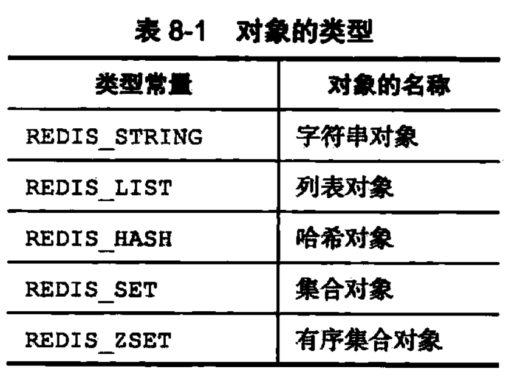

### 编码和底层实现

&emsp;&emsp;对象的 ptr 指针指向对象的底层实现数据结构，而这些数据机构由对象的 encoding 属性决定。

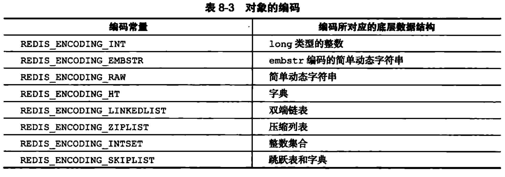

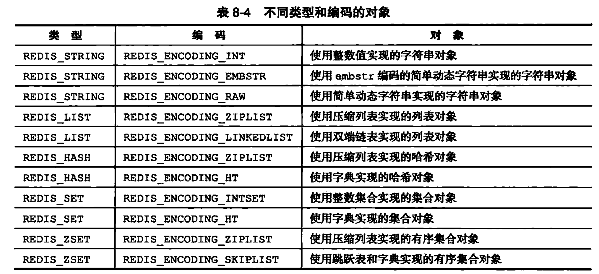


## 字符串对象

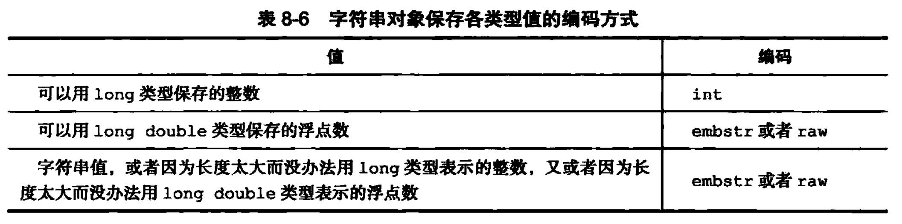

## 列表对象

&emsp;&emsp;列表对象的编码可以是 ziplist 或者 linkedlist。

## 哈希对象

&emsp;&emsp;哈希对象的编码可以是 ziplist 或者 hashtable。


## 集合对象

&emsp;&emsp;集合对象的编码可以是 intset 或者 hashtable。


## 有序集合对象

&emsp;&emsp;有序集合的编码可以是 ziplist 或者 skiplist。

&emsp;&emsp;ziplist 编码的有序集合对象使用压缩列表作为底层实现，每个集合元素使用两个紧挨在一起的压缩列表节点来保存，第一个节点保存元素的成员( member )，而第二个元素则保存元素的分值( score )。 压缩列表内的集合元素按分值从小到大进行排序，分值较小的元素被放置在靠近表头的位置，而分值较大的元素则被放置在靠近表尾的位置。

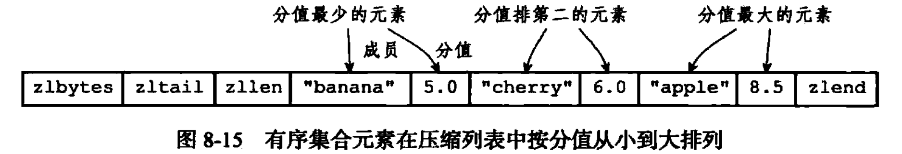


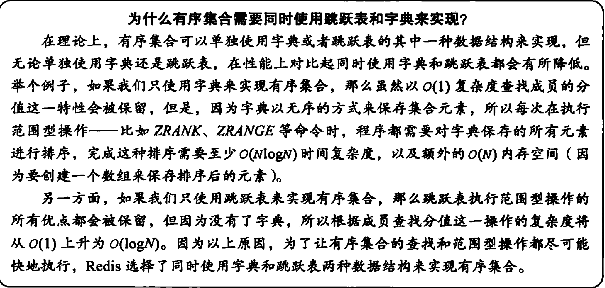


## 内存回收

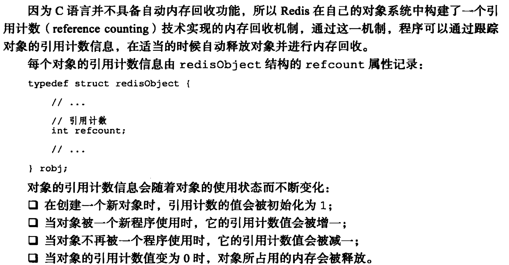

## 对象共享

&emsp;&emsp;数据库中保存的相同值对象越多，对象共享机制就能节约越多的内存

# 参考

- 《Redis 设计与实现》

